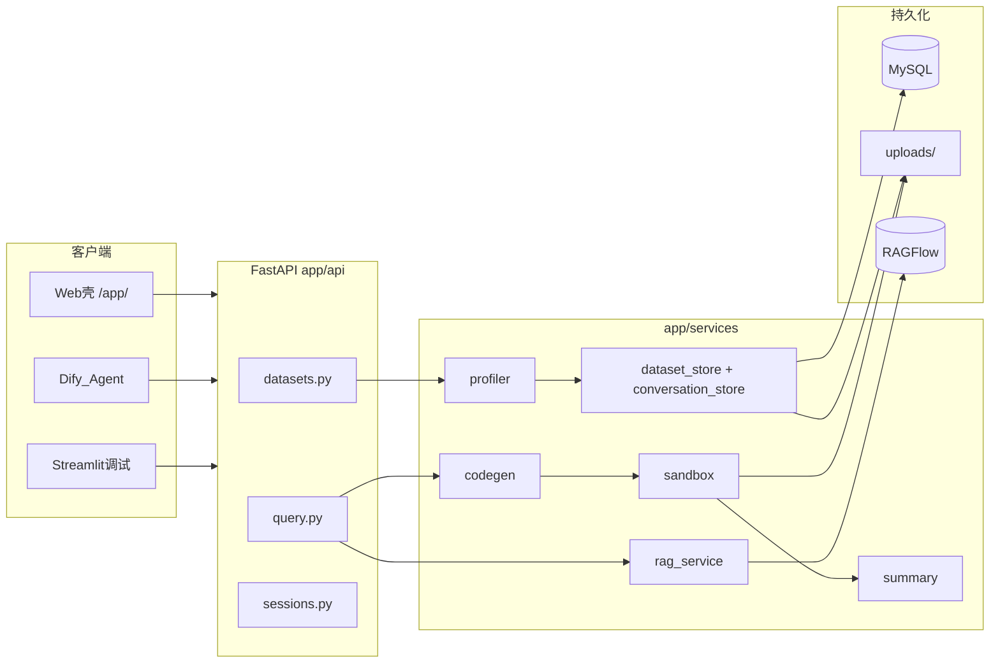

# RAVDA 项目精通学习手册

> **Retrieval-Augmented Visual Data Assistant** — 基于 RAG 的智能数据分析与可视化助手  
> 预计总学时：**20–28 小时**（建议 2–3 周，每天 1–2 个阶段）

---

## 如何使用本文档

1. 按 **阶段 0 → 8** 顺序执行，不要跳步（阶段 3 是核心，需预留充足时间）。
2. 每阶段包含四段：**目标 → 阅读 → 动手 → 验收**；完成验收后勾选进度框。
3. 附录 A–G 可在对应阶段按需查阅，阶段 7 结束后通读一遍。
4. 你已有 **RAGFlow / Dify / MySQL** 经验；本文档会跳过这些工具的基础安装，聚焦 RAVDA 如何调用与集成。
5. **Python 基础一般、未用过 FastAPI** 的同学，请重点阅读附录 A，并在阶段 0–3 反复对照 Swagger 与源码。

---

## 总进度追踪

- [ ] 阶段 0：环境与第一次跑通
- [ ] 阶段 1：项目地图
- [ ] 阶段 2：数据上传与画像
- [ ] 阶段 3：查询主链路（核心）
- [ ] 阶段 4：多轮会话
- [ ] 阶段 5：RAG 集成
- [ ] 阶段 6：前端与 Dify 编排
- [ ] 阶段 7：测试与调试
- [ ] 阶段 8：综合实战挑战
- [ ] 最终验收清单（20 条）

---

## 项目一句话

上传 CSV/Excel → 自动画像入库 → 自然语言提问 →（可选 RAG 语义检索）→ LLM/规则生成 Pandas 代码 → AST 沙箱执行 → 中文结论 → MySQL 多轮会话。

---

## 架构鸟瞰



### 持久化分工

| 数据 | 存储位置 |
|------|----------|
| 原始 CSV/Excel | `uploads/{dataset_id}.ext` |
| 数据集元数据 + 画像 JSON + 内容哈希 | MySQL `datasets` 表 |
| 会话与查询历史 | MySQL `conversation_sessions` / `conversation_turns` |
| 向量索引 | RAGFlow 知识库 `ravda-{dataset_id}` |

---

# 阶段 0：环境与第一次跑通

**预计时间**：1–2 小时  
**进度**：- [ ] 已完成

## 目标

- Conda 环境可用，MySQL 可连接
- 后端启动成功，Swagger 能完成一次完整 upload + query
- 理解 `QueryResponse` 各字段含义

## 阅读（30 分钟）

| 顺序 | 文件 | 关注点 |
|------|------|--------|
| 1 | `README.md` § 快速启动 | Conda、`.env`、uvicorn 命令 |
| 2 | `.env.example` | 对照你已有的 `.env`，确认 MySQL 变量 |
| 3 | `app/main.py` | 入口、`lifespan` 调 `init_schema()`、路由挂载 |

**`app/main.py` 关键逻辑**：

- 启动时 `lifespan` → `init_schema()` 自动建库建表
- 三个业务路由：`datasets_router`、`query_router`、`sessions_router`，前缀均为 `/api/v1`
- `/app/` 挂载静态 Web 壳（`frontend/web/`）
- `/openapi-dify.json` 供 Dify 导入工具 Schema

## 动手（60 分钟）

### 步骤 0.1：确认环境

```powershell
cd c:\Python_Project\RAVDA
conda activate ravda
python --version    # 应为 3.11.x
pip list | findstr fastapi
```

若环境不存在：

```powershell
conda env create -f environment.yml
conda activate ravda
pip install -r requirements.txt
```

### 步骤 0.2：配置 `.env`

```powershell
copy .env.example .env
# 编辑 .env，至少填写 MYSQL_PASSWORD
```

**最小可运行配置**（无 LLM、无 RAG 也能 query）：

```env
MYSQL_HOST=127.0.0.1
MYSQL_PORT=3306
MYSQL_USER=root
MYSQL_PASSWORD=你的密码
MYSQL_DATABASE=ravda
OPENAI_API_KEY=
RAGFLOW_BASE_URL=
RAGFLOW_API_KEY=
```

### 步骤 0.3：启动服务

```powershell
uvicorn app.main:app --reload --host 0.0.0.0 --port 8000
```

验证：

```powershell
curl http://127.0.0.1:8000/health
```

期望 JSON：`{"status":"ok","service":"ravda","rag_configured":false}`

### 步骤 0.4：Swagger 完整流程

1. 打开 http://127.0.0.1:8000/docs
2. **POST** `/api/v1/datasets/upload`  
   - 选择文件：`tests/data/sample_sales.csv`  
   - 记录响应中的 `profile.dataset_id`（32 位 hex）
3. **POST** `/api/v1/datasets/{dataset_id}/query`  
   - Body 示例：

```json
{
  "question": "各产品销售额合计是多少？"
}
```

4. 记录响应字段，填写下表：

| 字段 | 你的观察 | 含义 |
|------|----------|------|
| `generated_code` | | LLM/规则生成的 Python 代码 |
| `codegen_source` | `rule` 或 `llm` | 代码来源 |
| `result` | | 沙箱执行结果（表格/标量 JSON） |
| `charts` | | Base64 PNG 图表数组 |
| `summary` | | 中文结论 |
| `success` | | 是否执行成功 |
| `session_id` | | 本次会话 ID |
| `turn_index` | | 会话内轮次序号（从 0 起） |
| `rag_used` | | 是否使用了 RAG 检索 |
| `rag_skip_reason` | | RAG 跳过原因（若未使用） |

### 步骤 0.5：用 PowerShell 调用 API（可选）

```powershell
$base = "http://127.0.0.1:8000"
$form = @{ file = Get-Item "tests\data\sample_sales.csv" }
$upload = Invoke-RestMethod -Uri "$base/api/v1/datasets/upload" -Method Post -Form $form
$id = $upload.profile.dataset_id
$body = @{ question = "各产品销售额合计是多少？" } | ConvertTo-Json
$query = Invoke-RestMethod -Uri "$base/api/v1/datasets/$id/query" -Method Post -Body $body -ContentType "application/json"
$query.summary
```

## 验收

- [ ] 能解释 `QueryResponse` 每个字段（见上表）
- [ ] 知道 `OPENAI_API_KEY` 为空时 `codegen_source` 为 `rule`
- [ ] 知道启动日志里无 MySQL 报错
- [ ] 能说出 `/docs` 与 `/app/` 的区别

## 本阶段概念速查

| 概念 | 说明 |
|------|------|
| FastAPI | Python Web 框架，自动生成 OpenAPI/Swagger |
| Uvicorn | ASGI 服务器，运行 FastAPI 应用 |
| Pydantic | 用 Python 类定义请求/响应结构，自动校验 |
| lifespan | FastAPI 启动/关闭钩子，RAVDA 用于建表 |

> 详细 FastAPI 说明见 **附录 A**。

---

# 阶段 1：项目地图

**预计时间**：2 小时  
**进度**：- [ ] 已完成

## 目标

- 知道「改某功能该去哪个文件」
- 能口头描述 upload / query / session 三条链路

## 阅读（90 分钟）

| 顺序 | 文件 | 关注点 |
|------|------|--------|
| 1 | `MODULE.md` | 全局索引、RAGFlow/Dify 踩坑 |
| 2 | `app/MODULE.md` | 应用层结构 |
| 3 | `app/api/MODULE.md` | 路由清单 |
| 4 | `app/services/MODULE.md` | 各 service 职责 |
| 5 | `app/db/MODULE.md` | MySQL 表与 repository |
| 6 | `app/models/schemas.py` | 全部 API 数据结构（约 150 行） |

## 动手：文件 → 职责对照表

请填写（参考答案在表格下方，先自己写再对照）：

| 文件 | 职责（一句话） |
|------|----------------|
| `app/main.py` | |
| `app/config.py` | |
| `app/api/datasets.py` | |
| `app/api/query.py` | |
| `app/api/sessions.py` | |
| `app/services/profiler.py` | |
| `app/services/dataset_store.py` | |
| `app/services/codegen.py` | |
| `app/services/sandbox.py` | |
| `app/services/summary.py` | |
| `app/services/rag_service.py` | |
| `app/services/conversation_store.py` | |
| `app/db/schema.py` | |
| `app/db/repositories/dataset_repo.py` | |
| `app/db/repositories/conversation_repo.py` | |

<details>
<summary>参考答案（完成后点击展开）</summary>

| 文件 | 职责 |
|------|------|
| `app/main.py` | FastAPI 入口、CORS、路由挂载、静态 Web |
| `app/config.py` | 从 `.env` 加载全部配置常量 |
| `app/api/datasets.py` | 上传、列表、详情、RAG 状态/重建索引 |
| `app/api/query.py` | 自然语言查询主流程、数据集级会话 |
| `app/api/sessions.py` | 按 session_id 查询/删除会话 |
| `app/services/profiler.py` | 读 CSV/Excel、计算列画像 |
| `app/services/dataset_store.py` | 数据集门面：DB + 文件 + 触发 RAG 索引 |
| `app/services/codegen.py` | LLM/规则生成 Pandas 代码 |
| `app/services/sandbox.py` | AST 校验 + 受限 exec + 图表捕获 |
| `app/services/summary.py` | LLM/规则生成中文结论 |
| `app/services/rag_service.py` | RAGFlow 索引与检索 |
| `app/services/conversation_store.py` | 会话门面 + 历史格式化进 prompt |
| `app/db/schema.py` | 建表与迁移 |
| `app/db/repositories/dataset_repo.py` | datasets 表 CRUD |
| `app/db/repositories/conversation_repo.py` | 会话/轮次 CRUD |

</details>

## 动手：API 端点清单

完整端点见 **附录 E**。本阶段请手写一遍，并标注 HTTP 方法：

```
GET    /health
GET    /api/v1/public-config
GET    /api/v1/datasets
GET    /api/v1/datasets/{dataset_id}
POST   /api/v1/datasets/upload
GET    /api/v1/datasets/{dataset_id}/rag
POST   /api/v1/datasets/{dataset_id}/rag/reindex
POST   /api/v1/datasets/{dataset_id}/sessions
GET    /api/v1/datasets/{dataset_id}/sessions/latest
POST   /api/v1/datasets/{dataset_id}/query
GET    /api/v1/sessions/{session_id}
DELETE /api/v1/sessions/{session_id}
```

## 三条链路口述练习

### Upload 链路

```
客户端文件 → datasets.upload_dataset
  → SHA-256 去重
  → 写入 uploads/
  → profiler.profile_file
  → dataset_store.save_dataset → MySQL
  → rag_service.schedule_dataset_indexing（后台线程）
```

### Query 链路

```
query.query_dataset
  → get_dataset_profile
  → _resolve_session
  → ensure_dataset_indexed + retrieve_context
  → codegen.generate_pandas_code
  → sandbox.execute_pandas_code（失败则 regenerate + 重试）
  → summary.generate_summary
  → conversation_store.append_turn
  → QueryResponse
```

### Session 链路

```
create_session / get_session / append_turn
  → conversation_store
  → conversation_repo
  → MySQL conversation_sessions + conversation_turns
```

## 验收

- [ ] 对照表 15 个文件职责能说出 12 个以上
- [ ] 能不看文档口述三条链路
- [ ] 知道 `schemas.py` 是 API 契约的「单一真相源」

---

# 阶段 2：数据上传与画像

**预计时间**：3 小时  
**进度**：- [ ] 已完成

## 目标

理解：**文件 → Profile → MySQL → 去重 → RAG 后台索引**

## 阅读（90 分钟）

| 文件 | 重点函数/逻辑 |
|------|---------------|
| `app/api/datasets.py` | `upload_dataset`（L65–126）、`_validate_extension` |
| `app/services/profiler.py` | `read_dataframe`、`profile_dataframe`、`_build_column_profile` |
| `app/services/dataset_store.py` | `save_dataset`、`find_dataset_by_content_hash` |
| `app/db/repositories/dataset_repo.py` | `save_dataset`、`get_profile` |
| `app/db/schema.py` | `datasets` 表字段（L63–74） |

### 上传核心代码走读

`upload_dataset` 流程：

1. 校验扩展名（`.csv` / `.xlsx` / `.xls`）与大小（默认 50MB）
2. `content_hash = sha256(content)`
3. `find_dataset_by_content_hash` → 若命中则 `deduplicated=True` 直接返回
4. 否则 `uuid4().hex` 生成 `dataset_id`，写入 `uploads/{dataset_id}{ext}`
5. `profile_file` → `save_dataset` → 返回 `UploadResponse`

### ColumnProfile / DatasetProfile 字段

```python
# app/models/schemas.py
class ColumnProfile:
    name, dtype, null_rate, unique_count
    min_value, max_value, mean_value      # 数值列
    top_values                            # 分类列 Top N
    date_min, date_max                    # 日期列

class DatasetProfile:
    dataset_id, filename, row_count, column_count
    columns: list[ColumnProfile]
    preview: list[dict]                   # 前几行样例
```

## 动手实验

### 实验 2.1：内容去重

1. Swagger 连续两次上传 **同一个** `sample_sales.csv`
2. 第二次响应应含 `"deduplicated": true`，且 `dataset_id` 与第一次相同

### 实验 2.2：MySQL 验证

```sql
USE ravda;
SELECT dataset_id, original_filename, content_hash, rag_index_status, row_count
FROM datasets
ORDER BY created_at DESC
LIMIT 5;
```

观察：`profile_json` 列存完整画像 JSON。

### 实验 2.3：RAG 状态轮询

```powershell
# 替换 {id} 为你的 dataset_id
curl http://127.0.0.1:8000/api/v1/datasets/{id}/rag
```

若未配置 RAGFlow，`rag_index_status` 可能为 `skipped` 或 `pending`；配置后会在 `pending → indexing → ready` 间变化。

### 实验 2.4：阅读 sample_sales.csv

`tests/data/sample_sales.csv` 列：`product_name`, `sales_amount`, `order_date`, `region`  
注意第 6 行 `sales_amount` 为空 —— 观察画像中 `null_rate` 是否反映这一点。

## 验收

- [ ] 能解释 `content_hash` 去重原理
- [ ] 知道原始文件在 `uploads/`，元数据在 MySQL
- [ ] 能解释 `ColumnProfile` 各字段对 codegen 有何用（见 `_format_profile_context` in `codegen.py`）
- [ ] 知道上传失败时 `uploads/` 中的半成品会被删除（L114–115）

## 本阶段概念速查

> 详细 Pandas 说明见 **附录 B**。

| 概念 | 在 RAVDA 中的用法 |
|------|-------------------|
| `pd.read_csv` | `profiler.read_dataframe` 读上传文件 |
| `dtype` | 写入 `ColumnProfile.dtype` |
| `null_rate` | 空值比例，帮助 LLM 理解数据质量 |
| `preview` | 前若干行，注入 codegen prompt |

---

# 阶段 3：查询主链路 — 代码生成与沙箱

**预计时间**：4–5 小时（**核心阶段**）  
**进度**：- [ ] 已完成

## 目标

吃透 RAVDA 的心脏：`query.py` 编排 + `codegen` + `sandbox` + `summary`

## 阅读（2 小时）

按 **执行顺序** 阅读：

### 3.1 `app/api/query.py` — 10 步流水线

| 步骤 | 代码行 | 动作 |
|------|--------|------|
| 1 | L131–133 | 加载 `DatasetProfile`，不存在则 404 |
| 2 | L135–137 | 校验 `question` 非空 |
| 3 | L139 | `_resolve_session`：有 session_id 则校验绑定，否则新建 |
| 4 | L141–142 | `ensure_dataset_indexed` + `retrieve_context` |
| 5 | L145–150 | `generate_pandas_code` → `(code, codegen_source)` |
| 6 | L154–161 | `find_dataset_path` + `read_dataframe` |
| 7 | L164 | `execute_pandas_code(code, df)` |
| 8 | L167–187 | 失败且 `retry_count < MAX_RETRIES` 且有 API Key → `regenerate_pandas_code` |
| 9 | L191–202 | `generate_summary` |
| 10 | L204–236 | `append_turn` + 组装 `QueryResponse` |

### 3.2 `app/services/codegen.py`

- `_generate_with_llm`：OpenAI 兼容 API，prompt 含 profile + RAG + history
- `_generate_with_rules`：关键词/heuristic 模板（无 API Key 或 LLM 失败时）
- `regenerate_pandas_code`：把沙箱错误信息反馈给 LLM 修正代码
- 入口 `generate_pandas_code`：有 Key 先试 LLM，失败降级 rules

**沙箱环境约定**（写入 LLM prompt）：

- 预置变量：`df`, `pd`, `np`, `plt`（**禁止 import**）
- 最终结果赋给 `result`
- 图表用 `plt.figure()` + plot，**不要** `plt.show()`

### 3.3 `app/services/sandbox.py`

**AST 禁止项**：

| 类别 | 禁止内容 |
|------|----------|
| 语句 | `import` / `from ... import` |
| 危险调用 | `open`, `exec`, `eval`, `compile`, `__import__`, `breakpoint`, `input`, `getattr`, `setattr` |
| 危险模块名 | `os`, `sys`, `subprocess`, `shutil`, `pathlib`, `socket`, `requests`, `urllib`, `http`, `importlib`, `builtins`, `pickle`, `sqlite3`, `ctypes` |
| 危险属性 | `__import__`, `__subclasses__`, `__globals__`, `__code__`, `__builtins__` |

**执行环境**：

```python
namespace = {
    "df": df.copy(),   # 副本，避免污染原数据
    "pd": pd, "np": np, "plt": plt,
    "print": safe_print,
    "result": None,
}
exec(code, {"__builtins__": {}}, namespace)  # 空 builtins
```

**超时**：`ThreadPoolExecutor` + `future.result(timeout=SANDBOX_TIMEOUT_SEC)`，默认 30 秒。

**结果序列化** `_serialize_result`：

| Python 类型 | JSON 形态 |
|-------------|-----------|
| DataFrame | `{"type":"dataframe","rows":[...],"total_rows":N}`（最多 100 行） |
| Series | `{"type":"series","data":{...},"total_items":N}` |
| 标量 | 原样或 None（NaN/Inf → None） |

**图表**：遍历 `plt.get_fignums()`，最多 `MAX_CHART_COUNT`（默认 5）张，Base64 PNG。

### 3.4 `app/services/summary.py`

- 有 API Key：LLM 生成 2–3 句中文结论
- 无 Key / 失败：规则引擎从 `result` 提取关键数字

## 动手实验

### 实验 3.1：规则引擎 vs LLM

**A. 无 LLM**（`.env` 中 `OPENAI_API_KEY=` 为空，重启服务）：

```json
{"question": "按 region 汇总 sales_amount"}
```

记录 `codegen_source: "rule"` 和生成的 `code`。

**B. 有 LLM**（配置 Key 后重启）：

同一问题，对比 `code` 复杂度与 `codegen_source: "llm"`。

### 实验 3.2：触发重试

配置 LLM 后，提一个容易生成错误代码的问题，例如：

```json
{"question": "计算一个不存在的列 xyz 的平均值"}
```

观察：

- `success: false`
- `attempts` 可能为 1 或 2（取决于 `MAX_RETRIES`，默认 2）
- `error` 含执行错误信息

> 无 API Key 时不会重试（L167–170 条件要求 `OPENAI_API_KEY` 非空）。

### 实验 3.3：预览 Base64 图表

1. 提问：「按 region 画 sales_amount 柱状图」
2. 从响应复制 `charts[0].data`（Base64 字符串）
3. 浏览器打开 https://www.base64decode.org/ 或使用 Python：

```python
import base64
from pathlib import Path
b64 = "粘贴 charts[0].data"
Path("chart.png").write_bytes(base64.b64decode(b64))
```

### 实验 3.4：沙箱安全

Swagger 无法直接测 AST，运行单元测试：

```powershell
pytest tests/test_query_pipeline.py::test_sandbox_rejects_import -v
```

或阅读 `test_sandbox_rejects_import` 理解 import 如何被拒绝。

### 实验 3.5：画 query 时序图

在纸上或工具中画出：从 POST `/query` 到返回 JSON 的完整调用链（至少 8 个函数名）。

## 验收

- [ ] 能复述 10 步流水线（不看文档）
- [ ] 能列举至少 5 项 AST 禁止规则
- [ ] 能解释 `result` 三种序列化形态
- [ ] 知道 `MAX_RETRIES=2` 表示最多 **3 次执行**（1 次初始 + 2 次重试）
- [ ] 知道规则引擎与 LLM 的切换条件

## 本阶段概念速查

> 详细 AST 沙箱说明见 **附录 C**。

---

# 阶段 4：多轮会话

**预计时间**：2 小时  
**进度**：- [ ] 已完成

## 目标

理解 MySQL 会话模型、轮次裁剪、历史如何注入 LLM prompt

## 阅读（60 分钟）

| 文件 | 重点 |
|------|------|
| `app/services/conversation_store.py` | `format_history_for_prompt`（最近 **5** 轮） |
| `app/db/repositories/conversation_repo.py` | `append_turn`、`MAX_CONVERSATION_TURNS` 裁剪 |
| `app/api/query.py` | `_resolve_session`（L33–62） |
| `app/api/sessions.py` | GET / DELETE 会话 |
| `app/db/schema.py` | `conversation_sessions`、`conversation_turns` 表 |

### 会话行为要点

1. **不传 `session_id`**：每次 query **新建**一个会话（L58–62）
2. **传 `session_id`**：追加到已有会话，并校验 `session.dataset_id == dataset_id`
3. **历史进 prompt**：`format_history_for_prompt` 取最后 5 轮，含 question、summary、成功时的 code 预览（最多 600 字符）
4. **DB 裁剪**：每会话最多保留 `MAX_CONVERSATION_TURNS`（默认 10）轮

### `_resolve_session` 逻辑

```
if session_id:
    加载会话 → 404 若不存在 → 400 若 dataset 不匹配
    return (session_id, session.turns)
else:
    create_session(dataset_id)
    return (new_session_id, [])
```

## 动手实验

### 实验 4.1：显式多轮

```powershell
$base = "http://127.0.0.1:8000"
$id = "你的dataset_id"

# 第 1 轮 — 不传 session_id
$q1 = @{ question = "按 region 汇总 sales_amount" } | ConvertTo-Json
$r1 = Invoke-RestMethod -Uri "$base/api/v1/datasets/$id/query" -Method Post -Body $q1 -ContentType "application/json"
$sid = $r1.session_id

# 第 2 轮 — 传入 session_id 追问
$q2 = @{ question = "只要 East 和 West"; session_id = $sid } | ConvertTo-Json
$r2 = Invoke-RestMethod -Uri "$base/api/v1/datasets/$id/query" -Method Post -Body $q2 -ContentType "application/json"
$r2.turn_index   # 应为 1
```

### 实验 4.2：查看完整会话

```powershell
Invoke-RestMethod -Uri "$base/api/v1/sessions/$sid"
# 或
Invoke-RestMethod -Uri "$base/api/v1/datasets/$id/sessions/latest"
```

### 实验 4.3：MySQL 验证

```sql
SELECT session_id, dataset_id, created_at FROM conversation_sessions ORDER BY updated_at DESC LIMIT 3;

SELECT session_id, turn_index, question, success, LEFT(summary, 80) AS summary_preview
FROM conversation_turns
WHERE session_id = '你的session_id'
ORDER BY turn_index;
```

### 实验 4.4：跨数据集误用 session

用 dataset A 的 `session_id` 去 query dataset B，应返回 **400**。

## 验收

- [ ] 知道不传 `session_id` 会**新建**会话（不是自动续接最近一次）
- [ ] 知道 Dify Agent 应在提示词中维护并回传 `session_id`
- [ ] 知道 prompt 只用最近 5 轮，DB 最多存 10 轮
- [ ] 能解释 `format_history_for_prompt` 输出格式

---

# 阶段 5：RAG 集成

**预计时间**：2 小时  
**进度**：- [ ] 已完成

## 目标

理解 RAVDA 在 RAGFlow 之上做了什么、**没做什么**

## 阅读（60 分钟）

| 文件 | 重点 |
|------|------|
| `app/services/rag_service.py` | `index_dataset`、`retrieve_context`、`profile_to_markdown` |
| `app/services/ragflow_client.py` | `is_rag_configured`、`get_ragflow_client` |
| `MODULE.md` § RAGFlow 踩坑 | SDK 版本、httpx 502、勿用高版本 API |

### RAVDA 的 RAG 边界

| RAVDA 做 | RAVDA 不做 |
|----------|------------|
| 每 dataset 一个 KB：`ravda-{dataset_id}` | 不用 RAGFlow 替代 Pandas 执行 |
| 索引：画像 Markdown（naive 分块）+ 原始表（table 分块） | 不把全量 DataFrame 灌入向量库 |
| 检索结果注入 codegen prompt | 不用 RAGFlow Chat 替代 codegen |
| 索引未就绪时降级跳过，不阻断 query | 不用 RAG 结果做精确 min/max/mean（以 Profile 为准） |

### 索引状态流转

`pending` → `indexing` → `ready` | `failed` | `skipped`

- `ensure_dataset_indexed`：pending/failed 时后台线程重新索引
- `retrieve_context`：仅 `ready` 时调用 `client.retrieve(dataset_ids=[kb_id], ...)`

### 中文语义增强

`profile_to_markdown` 使用 `COLUMN_ZH_HINTS` 为常见列名添加中文别名，便于口语化提问匹配。

## 动手实验

### 实验 5.1：配置 RAGFlow

在 `.env` 中填写（使用你已有实例）：

```env
RAGFLOW_BASE_URL=http://你的地址:8880
RAGFLOW_API_KEY=你的key
RAG_ENABLED=true
```

重启服务，`GET /health` 应显示 `"rag_configured": true`。

### 实验 5.2：冒烟脚本

```powershell
python scripts/ragflow_smoke_test.py
python scripts/rag_e2e_test.py
```

### 实验 5.3：端到端 RAG query

1. 上传新数据集
2. 轮询 `GET /api/v1/datasets/{id}/rag` 直到 `rag_index_status=ready`
3. 用口语化列名提问，例如：「各**地区**的**销售额**合计」（对应 `region`、`sales_amount`）
4. 对比响应：`rag_used: true`，`rag_chunk_count > 0`

### 实验 5.4：降级行为

临时清空 `RAGFLOW_API_KEY`，重启后 query，观察 `rag_skip_reason`（如 `not_configured`）。

## 验收

- [ ] 知道一 `dataset_id` 对应一 KB 名 `ravda-{dataset_id}`
- [ ] 知道 RAG 只是 codegen 前的语义补充
- [ ] 知道 SDK 固定 `ragflow-sdk==0.19.0`，勿调用 Memory API 等 0.24+ 能力
- [ ] 知道 `httpx` 直连 RAGFlow 易 502，项目用 `ragflow-sdk`

---

# 阶段 6：前端与 Dify 编排

**预计时间**：2–3 小时  
**进度**：- [ ] 已完成

## 目标

理解用户如何触达 API；Dify 是对话壳，分析执行在 RAVDA

## 阅读（60 分钟）

| 文件 | 关注点 |
|------|--------|
| `frontend/web/js/app.js` | 侧栏上传、数据集列表、轮询 `sessions/latest` |
| `frontend/web/js/api.js` | 封装 REST 调用 |
| `frontend/web/index.html` | 三栏布局 |
| `scripts/dify_openapi.json` | Dify 工具 Schema |
| `README.md` § Dify 接入 | Docker 网络、OpenAPI 导入、SSRF 超时 |

### Web 壳三栏

| 区域 | 功能 |
|------|------|
| 左栏 | 上传、最近数据集、RAG 状态、复制 `dataset_id` |
| 中栏 | Dify Agent iframe（`DIFY_EMBED_URL`） |
| 右栏 | 轮询最新会话，展示 **summary / 表格 / 图表**（**不展示 code**） |

### 轮询机制

- `GET /api/v1/public-config` 获取 `pollIntervalSec`（默认 4 秒）
- 定时请求 `GET /api/v1/datasets/{id}/sessions/latest`
- 比较 `updated_at` 变化后刷新右栏

### Dify 集成要点

1. 容器内访问 RAVDA 用 `http://host.docker.internal:8000`，**不是** `127.0.0.1`
2. 导入 OpenAPI 用 `/openapi-dify.json`，**勿用** `/openapi.json`（3.1 + `$ref`，Dify 报错）
3. `POST /upload` 需手动添加（multipart 无法自动导入）
4. Agent 提示词需维护 `dataset_id`、`session_id`
5. Dify SSRF 超时建议 ≥ 120s（query 较慢）

## 动手实验

### 实验 6.1：Web 壳

1. 配置 `.env` 中 `DIFY_EMBED_URL`（可选，无 Dify 时中栏空白）
2. 打开 http://127.0.0.1:8000/app/
3. 左栏上传文件，观察 RAG 状态徽章
4. 若配置了 Dify：在 Agent 中提问，观察右栏是否更新

### 实验 6.2：Dify 连通性

```powershell
python scripts/dify_connectivity_test.py
```

### 实验 6.3：（可选）Dify 工具导入

1. Dify 控制台 → 工具 → 从 URL 导入：`http://host.docker.internal:8000/openapi-dify.json`
2. 手动添加 upload 工具
3. 创建 Agent，系统提示词要求保存 `dataset_id` / `session_id`
4. 走一遍：上传 → 提问 → 追问

### 实验 6.4：Streamlit 调试 UI（可选）

```powershell
streamlit run frontend/streamlit_app.py --server.port 8501
```

Streamlit 直连 API，适合调试（会展示 code），与 Web 壳定位不同。

## 验收

- [ ] 知道 Web 壳不展示 `generated_code`
- [ ] 知道 Dify 负责对话，RAVDA 负责数据分析
- [ ] 知道 `dataset_id` 由 Agent 在工具调用后保存并在后续 query 传入
- [ ] 能解释 `/api/v1/public-config` 的作用

---

# 阶段 7：测试与调试

**预计时间**：2 小时  
**进度**：- [ ] 已完成

## 目标

建立「改代码 → pytest 验证」习惯；会用 Swagger + 日志定位 query 失败点

## 阅读（60 分钟）

| 文件 | 内容 |
|------|------|
| `tests/conftest.py` | 自动 `init_schema`、默认禁用 RAG、`sample_dataset_id` fixture |
| `tests/test_query_pipeline.py` | codegen、sandbox、summary、query API、多轮 |
| `tests/test_datasets_api.py` | 列表、详情、去重 |
| `tests/test_rag_service.py` | RAG 单元测试（mock SDK） |
| `scripts/smoke_test.py` | 端到端冒烟 |

### 测试前置条件

- **需要 MySQL**：`conftest.py` 在 session 级调用 `init_schema()`
- **默认禁用 RAG**：`disable_rag_by_default` autouse fixture
- **默认禁用 LLM**：部分测试用 `disable_llm` fixture

### 测试文件地图

| 文件 | 覆盖范围 |
|------|----------|
| `test_query_pipeline.py` | 规则 codegen、沙箱、summary、query API、多轮、session 校验 |
| `test_datasets_api.py` | 列表、详情、上传去重 |
| `test_rag_api.py` | upload 返回 rag 状态、health |
| `test_rag_service.py` | profile_to_markdown、retrieve mock |

## 动手实验

### 实验 7.1：跑全量测试

```powershell
cd c:\Python_Project\RAVDA
conda activate ravda
pytest tests/ -v
```

记录通过/失败数量。若有失败，读 traceback 判断是 MySQL 连接还是其他问题。

### 实验 7.2：跑单个模块

```powershell
pytest tests/test_query_pipeline.py -v
pytest tests/test_datasets_api.py::test_upload_deduplicates_identical_file -v
```

### 实验 7.3：冒烟脚本

```powershell
python scripts/smoke_test.py
```

### 实验 7.4：调试 query 失败

故意制造失败（如错误 dataset_id），在终端观察 uvicorn 日志：

```
POST /api/v1/datasets/badid/query → 404
```

对有 LLM 的失败 query，按流水线逐步排查：

1. codegen 是否抛 500？
2. sandbox `success` 是否为 false？看 `error`
3. `attempts` 是否用尽？
4. summary 是否仍返回（降级为空或规则）？

## 验收

- [ ] 知道 pytest 需要 MySQL 运行
- [ ] 知道测试默认关闭 RAG
- [ ] 能运行单个测试用例
- [ ] 能根据 `QueryResponse.error` 判断失败在 codegen 还是 sandbox

---

# 阶段 8：综合实战 — 改造挑战

**预计时间**：4+ 小时  
**进度**：- [ ] 已完成

以下 5 个挑战**不提供标准答案**，只给方向与涉及文件。建议按顺序完成，每题完成后跑相关 pytest。

## 挑战 1：ColumnProfile 增加中位数

**目标**：数值列画像增加 `median_value` 字段，并在 API 响应中可见。

**提示文件**：

- `app/services/profiler.py` — `_build_column_profile`
- `app/models/schemas.py` — `ColumnProfile`
- `tests/test_query_pipeline.py` — 可加断言

**验收**：上传含数值列的 CSV，`GET /datasets/{id}` 的 profile 含 `median_value`。

---

## 挑战 2：规则引擎支持新问法

**目标**：在 `_generate_with_rules` 中增加一种问法模板，例如「前 N 行」或「空值最多的列」。

**提示文件**：

- `app/services/codegen.py` — `_generate_with_rules`
- `tests/test_query_pipeline.py` — 参考 `test_rule_codegen_groupby_bar`

**验收**：无 API Key 时，新问法能返回可执行 code 且 sandbox `success=true`。

---

## 挑战 3：沙箱支持 seaborn

**目标**：允许生成的代码使用 `sns`（seaborn）绘图。

**提示文件**：

- `app/services/sandbox.py` — `_run_code` 的 namespace
- `requirements.txt` / `environment.yml` — 添加 seaborn 依赖
- `app/services/codegen.py` — 更新 LLM prompt 中的可用变量说明

**验收**：query 生成 seaborn 图表，`charts` 非空。注意 AST 仍禁止 import —— 需在 namespace 预置 `sns`。

---

## 挑战 4：QueryResponse 增加执行耗时

**目标**：响应增加 `execution_ms` 字段，记录沙箱执行耗时（不含 codegen）。

**提示文件**：

- `app/services/sandbox.py` — `execute_pandas_code` 内计时
- `app/models/schemas.py` — `QueryResponse`
- `app/api/query.py` — 传递耗时到响应

**验收**：Swagger query 响应含合理 `execution_ms`（通常 < 30000）。

---

## 挑战 5：手动 reindex 并验证 RAG

**目标**：对 `rag_index_status=failed` 的数据集调用 reindex API，确认恢复为 `ready` 且 query 时 `rag_used=true`。

**提示文件**：

- `app/api/datasets.py` — `reindex_dataset_rag`
- `app/services/rag_service.py` — `reindex_dataset`
- `scripts/rag_e2e_test.py` — 参考流程

**验收**：`POST /datasets/{id}/rag/reindex` 后状态变 `ready`；口语化提问 `rag_used=true`。

---

# 最终验收清单（自测精通）

完成全部阶段后，逐项勾选：

## 架构与数据流

- [ ] 能独立画出 upload / query / session 三条链路图
- [ ] 能说明 `uploads/` 与 MySQL `datasets` 的分工
- [ ] 能解释 RAG 在 query 流水线中的位置与降级策略

## 核心逻辑

- [ ] 能复述 `query_dataset` 的 10 个步骤
- [ ] 能解释 LLM 与规则 codegen 的切换条件
- [ ] 能列举沙箱 AST 至少 5 条禁止规则
- [ ] 能解释 `result` 序列化的三种形态
- [ ] 知道 `MAX_RETRIES` 与 `attempts` 字段的关系

## 会话与 RAG

- [ ] 知道不传 `session_id` 会新建会话
- [ ] 知道 prompt 历史取最近 5 轮、DB 最多 10 轮
- [ ] 知道一 dataset 一 KB，命名 `ravda-{dataset_id}`
- [ ] 知道 Profile 负责精确统计、RAG 负责语义别名

## 集成与运维

- [ ] 知道 Dify 容器访问 RAVDA 用 `host.docker.internal`
- [ ] 知道 Web 壳不展示 code，靠轮询 `sessions/latest`
- [ ] 会用 pytest 验证改动
- [ ] 能排查 MySQL 连接失败
- [ ] 能排查 RAG `pending` 长期不变
- [ ] 能排查 query 无 charts 的原因（代码未画图 / 超 MAX_CHART_COUNT）
- [ ] 能排查 Dify 工具调用超时（SSRF 配置）

## 实战能力

- [ ] 完成阶段 8 至少 3 个挑战
- [ ] 能在 30 分钟内定位一个 query 失败的原因（codegen / sandbox / 数据）

---

# 附录 A：FastAPI / Pydantic 最小必要知识

## FastAPI 路由

```python
from fastapi import APIRouter

router = APIRouter(prefix="/datasets", tags=["datasets"])

@router.get("/{dataset_id}")
def get_dataset(dataset_id: str) -> DatasetDetailResponse:
    ...
```

- `@router.get/post` 定义 HTTP 方法与路径
- 路径参数 `{dataset_id}` 自动注入函数参数
- `response_model=` 指定响应 Schema，自动生成 OpenAPI 文档

## 请求体

```python
@router.post("/{dataset_id}/query")
def query_dataset(dataset_id: str, body: QueryRequest) -> QueryResponse:
    question = body.question
```

FastAPI 自动把 JSON body 解析为 `QueryRequest`（Pydantic 模型），校验失败返回 422。

## 文件上传

```python
@router.post("/upload")
async def upload_dataset(file: UploadFile = File(...)):
    content = await file.read()
```

## 挂载子路由

```python
# main.py
app.include_router(datasets_router, prefix="/api/v1")
# 最终路径: /api/v1/datasets/upload
```

## Pydantic 模型

```python
class QueryRequest(BaseModel):
    question: str = Field(min_length=1, max_length=2000)
    session_id: str | None = None
```

- 字段类型注解即校验规则
- `Field(...)` 添加约束与文档
- `.model_validate(dict)` 从 dict 构造模型

## 异常

```python
raise HTTPException(status_code=404, detail="Dataset not found")
```

## 本项目中的 async

- `upload_dataset` 是 `async`（读上传流）
- 多数 route 是同步 `def` —— FastAPI 会在线程池运行，对 MVP 足够

---

# 附录 B：Pandas / Matplotlib 在本项目中的用法

## 读文件

```python
# profiler.py
df = pd.read_csv(path)           # CSV
df = pd.read_excel(path)         # Excel（需 openpyxl）
```

## 画像统计

| 统计 | 代码思路 |
|------|----------|
| null_rate | `series.isna().mean()` |
| unique_count | `series.nunique()` |
| min/max/mean | 数值列 `series.min/max/mean()` |
| top_values | `series.value_counts().head(5)` |
| date_min/max | 日期列转 datetime 后 min/max |

## 沙箱中的绘图

```python
# 生成的代码应类似：
plt.figure()
df.groupby("region")["sales_amount"].sum().plot(kind="bar")
result = df.groupby("region")["sales_amount"].sum()
# 不要 plt.show()
```

RAVDA 在 exec 后自动 `savefig` 所有 open figures。

## 中文图表

`sandbox.py` 启动时配置 CJK 字体（Microsoft YaHei 等），避免中文乱码。

---

# 附录 C：AST 沙箱与安全模型

## 为什么用 AST

在 `exec` 前解析代码为抽象语法树，遍历节点拦截危险结构 —— 比黑名单字符串匹配更可靠。

## 执行模型

```
validate_ast(code)  →  失败则返回 SandboxResult(success=False)
       ↓
ThreadPoolExecutor  →  _run_code(code, df.copy())
       ↓
exec(code, {"__builtins__": {}}, namespace)
       ↓
_serialize_result(namespace["result"])
_capture_charts()
```

## 已知限制（MVP 可接受）

- 不是完整 Python 沙箱，理论上仍存在逃逸风险 —— 生产环境需更强隔离（容器、Pyodide 等）
- 仅预置 `pd/np/plt`，复杂库不可用
- DataFrame 结果截断 100 行

## 相关测试

```powershell
pytest tests/test_query_pipeline.py::test_sandbox_executes_and_returns_chart -v
pytest tests/test_query_pipeline.py::test_sandbox_rejects_import -v
```

---

# 附录 D：环境变量速查表

| 变量 | 默认值 | 说明 |
|------|--------|------|
| `HOST` | `127.0.0.1` | 绑定地址；Docker 场景用 `0.0.0.0` |
| `PORT` | `8000` | 端口 |
| `DIFY_TOOL_BASE_URL` | — | Dify 容器访问 RAVDA 的 Base URL |
| `DIFY_EMBED_URL` | — | Web 壳 iframe 地址 |
| `WEB_POLL_INTERVAL_SEC` | `4` | 右栏轮询间隔 |
| `UPLOAD_DIR` | `uploads` | 上传目录 |
| `MAX_UPLOAD_SIZE_MB` | `50` | 上传大小上限 |
| `OPENAI_API_KEY` | 空 | 空则规则 codegen |
| `OPENAI_BASE_URL` | OpenAI 官方 | 兼容 API 地址 |
| `LLM_MODEL` | `gpt-4o-mini` | 模型名 |
| `LLM_TIMEOUT_SEC` | `60` | LLM 请求超时 |
| `MAX_RETRIES` | `2` | 沙箱失败重试次数 |
| `SANDBOX_TIMEOUT_SEC` | `30` | 代码执行超时 |
| `MAX_CHART_COUNT` | `5` | 最多返回图表数 |
| `MAX_CONVERSATION_TURNS` | `10` | 每会话 DB 保留轮次 |
| `MYSQL_*` | 见 `.env.example` | MySQL 连接 |
| `RAGFLOW_BASE_URL` | 空 | 空则跳过 RAG |
| `RAGFLOW_API_KEY` | 空 | RAGFlow 鉴权 |
| `RAG_ENABLED` | `true` | RAG 总开关 |
| `RAG_TOP_K` | `5` | 检索 chunk 数 |
| `RAG_SIMILARITY_THRESHOLD` | `0.2` | 相似度阈值 |
| `RAG_INDEX_POLL_INTERVAL_SEC` | `5` | 索引轮询间隔 |
| `RAG_INDEX_MAX_WAIT_SEC` | `300` | 索引最长等待 |

完整模板见项目根目录 `.env.example`。

---

# 附录 E：API 端点速查表

| 方法 | 路径 | 说明 |
|------|------|------|
| GET | `/` | API 欢迎信息 |
| GET | `/health` | 健康检查 + `rag_configured` |
| GET | `/docs` | Swagger UI |
| GET | `/openapi-dify.json` | Dify 工具 Schema |
| GET | `/api/v1/public-config` | 前端公开配置 |
| GET | `/app/` | Web 壳静态页 |
| GET | `/api/v1/datasets` | 最近数据集列表 |
| GET | `/api/v1/datasets/{id}` | 数据集详情 + profile |
| POST | `/api/v1/datasets/upload` | 上传 CSV/Excel |
| GET | `/api/v1/datasets/{id}/rag` | RAG 索引状态 |
| POST | `/api/v1/datasets/{id}/rag/reindex` | 重建 RAG 索引 |
| POST | `/api/v1/datasets/{id}/sessions` | 创建空会话 |
| GET | `/api/v1/datasets/{id}/sessions/latest` | 最近会话 |
| POST | `/api/v1/datasets/{id}/query` | **自然语言查询** |
| GET | `/api/v1/sessions/{id}` | 获取会话 |
| DELETE | `/api/v1/sessions/{id}` | 删除会话 |

---

# 附录 F：15 个核心文件推荐阅读顺序

按优先级排序，通读一遍约 4–6 小时：

| # | 文件 | 为什么先读 |
|---|------|------------|
| 1 | `app/main.py` | 入口与路由全景 |
| 2 | `app/config.py` | 所有可调参数 |
| 3 | `app/models/schemas.py` | API 契约 |
| 4 | `app/api/query.py` | 核心业务流水线 |
| 5 | `app/services/codegen.py` | 代码如何生成 |
| 6 | `app/services/sandbox.py` | 代码如何执行 |
| 7 | `app/services/summary.py` | 结论如何生成 |
| 8 | `app/api/datasets.py` | 上传与 RAG 状态 |
| 9 | `app/services/profiler.py` | 数据如何画像 |
| 10 | `app/services/dataset_store.py` | 数据集门面 |
| 11 | `app/services/rag_service.py` | RAG 索引与检索 |
| 12 | `app/services/conversation_store.py` | 多轮上下文 |
| 13 | `app/db/schema.py` | 表结构 |
| 14 | `app/db/repositories/dataset_repo.py` | 数据集 SQL |
| 15 | `tests/test_query_pipeline.py` | 行为规格说明书 |

---

# 附录 G：常见问题 FAQ

## MySQL 相关

**Q: 启动报 `Failed to initialize database schema`？**  
A: 检查 MySQL 是否运行、`.env` 中 `MYSQL_PASSWORD` 是否正确、用户是否有建库权限。RAVDA 会调用 `ensure_database()` 自动创建 `MYSQL_DATABASE`。

**Q: 测试全部 skip 或 connection refused？**  
A: pytest 依赖真实 MySQL；先 `init_schema()` 成功再跑测试。

## Query 相关

**Q: `codegen_source` 一直是 `rule`？**  
A: `OPENAI_API_KEY` 为空或 LLM 调用失败。检查 Key、Base URL、网络。

**Q: `success: false` 且无重试？**  
A: 无 API Key 时不触发 retry 循环。配置 Key 或修复规则引擎模板。

**Q: 没有 charts？**  
A: 生成代码未创建 matplotlib figure，或图表数超过 `MAX_CHART_COUNT`，或执行失败。

**Q: `result` 为 null？**  
A: 代码未赋值 `result`，或结果为 NaN/Inf 被 sanitize。

## RAG 相关

**Q: `rag_index_status` 长期 `pending`？**  
A: 后台索引线程可能失败；查 `rag_index_error` 字段或 RAGFlow 日志。运行 `ragflow_smoke_test.py`。

**Q: `rag_used: false` 但 RAG 已配置？**  
A: 索引未 `ready`、相似度低于阈值、或问题与索引内容不匹配。看 `rag_skip_reason`。

**Q: httpx 调 RAGFlow 502？**  
A: 项目已弃用 httpx 直连，用 `ragflow-sdk`。见 `MODULE.md`。

## Dify 相关

**Q: Dify 工具导入失败？**  
A: 用 `/openapi-dify.json`，勿用 `/openapi.json`。

**Q: Dify 调用 query 超时？**  
A: 增大 Dify 的 `SSRF_DEFAULT_*_TIME_OUT`（建议 ≥120s）。

**Q: Docker 内连不上 RAVDA？**  
A: 用 `host.docker.internal:8000`，且 RAVDA 启动时 `--host 0.0.0.0`。

## 会话相关

**Q: 多轮追问没有上下文？**  
A: 检查是否每次 query 都传了同一 `session_id`；不传会新建会话。

**Q: Web 壳右栏不更新？**  
A: 确认 Dify Agent 确实调用了 RAVDA query；右栏轮询的是 `sessions/latest`，不是 Dify 内部状态。

---

## 下一步建议

1. 从 **阶段 0** 开始，严格按验收清单勾选。
2. 阶段 3 完成后，回头重读 `app/api/query.py`，应能无停顿通读。
3. 阶段 8 挑战是检验精通的最好方式；建议至少完成挑战 1、3、4。
4. 修改代码后始终跑 `pytest tests/ -v` 确认无回归。

祝学习顺利。
